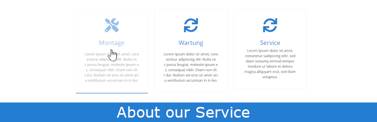
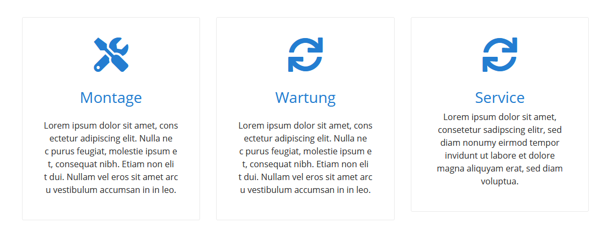
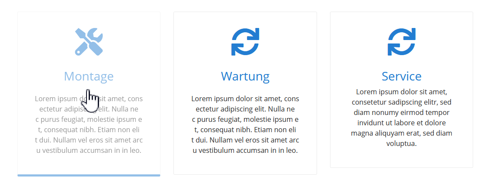
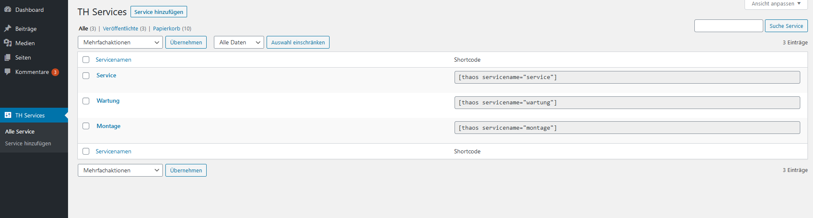
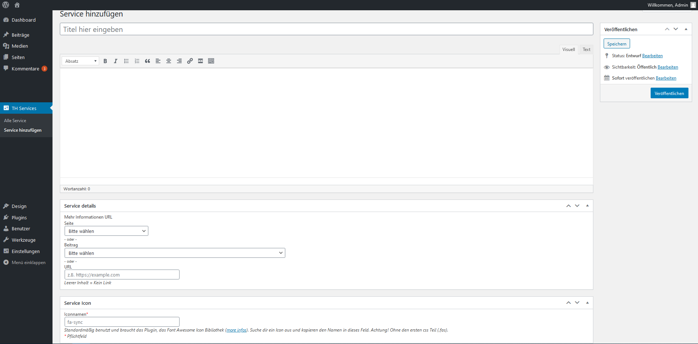
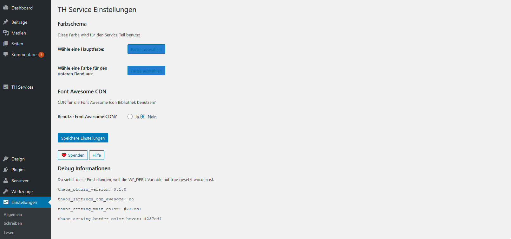

# About our services
> :warning: This is a development version. Dont use this git clone repository for the production!

    

 
Project:             | Wordpress Plugin
-------------------|----------------
Contributors:      | [triopsi](https://github.com/triopsi)
Donate link:	   | https://www.paypal.me/triopsihosting
Tags             | about, aboutusservice, service, offer, site, post, shortcode, site, post
Requires at least:	   |  5.3
Tested up to:	   |  5.9
Requires PHP:	   |  7.4
Stable tag:	   |  1.5.0
License:	   |  GPLv3
License URI:	   | https://www.gnu.org/licenses/gpl-3.0

A simple about our services plugin. Create items and copy-paste the shortcode everywhere in your post or site.
 
## Description

The "about our services" plugin is a very simple way, to show your services on your site or blog post. It's have a responsive design
and is very easys to use it. Choose icons and create descriptions on the admin panel of wordpress. Add than copy the shortcode in a post or site.

### Create features
 
*   Create and manage services
*   Add Shortcodes in your post or sites 
*   Responsives design

### Bugs, technical hints or contribute

Please give me feedback, contribute and file technical bugs on [GitHub Repository](https://github.com/triopsi/th-about-our-services). Thanks :)

### Credits

Developed by [Triopsi Hosting](https://triopsi-hosting.com)

## Installation
 
1. Upload `th-about-our-services` to the `/wp-content/plugins/` directory
1. Activate the plugin through the 'Plugins' menu in WordPress
 
## Frequently Asked Questions
 
Nothing yet.
 
## Screenshots

1. "About our Service" on site default layout

2. "About our Service" on site default layout - Move Over

3. Admin Page - Overview

4. Admin Page - Add new Service

5. Admin Page - Settings

 
## Changelog

### 1.5.0
* Fix Fontawesome Icons

### 1.4.0
* Update Translate
* Category manage
* add CSS padding for Boxes
* show single box with id

### 1.3.0
* Boxes update 

### 1.2.0
* Add Attribute "class_boxes"

### 1.1.2
* FIX Mobile Design

### 1.1.1
* FIX Word break

### 1.1.0
* Change to flex container
* Add Help page

### 1.0.4
* Tested up for wp 5.7

### 1.0.3
* php echo fix
* css color fix

### 1.0.2
* functions deprecated fix

### 1.0.1
* mobile fix

### 1.0.0
* First release.

## Upgrade Notice

Nothing.

## Donations

If you like the plugin, consider a donation to support further development. [Click here](https://www.paypal.me/triopsihosting)
 
